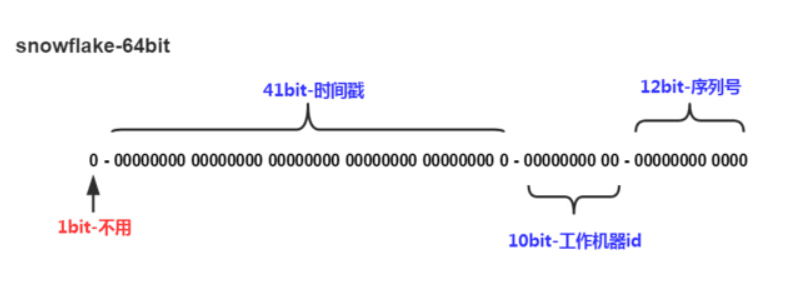

# ReadMe


A C# BitField library.   
这是一个在 C# 中的位域操作库，在没有原生语法糖加持的情况下，已经是非常舒服的写法了。

作者封装了用于实现位域的各种位移，且，或操作，使得在 C# 中也能灵活操作内存中的任意一个 bit。

位域操作可能是个比较小众的使用场景，欢迎大家互通有无。

Examples:

0x00. Demo (示例)
``` C#
ABT bT = new ABT() { EA = A.Eghit | A.Two, EB = B.Three, IsBitFields = true };
// 是的,支持枚举, 甚至其他unmanaged数据
// 比如自定义的struct也是支持的(但内存布局需要紧凑模式:[StructLayout(LayoutKind.Sequential, Pack = 1)])
[Flags]
enum A : byte
{
    Zero = 0,
    One = 1 << 0,
    Two = 1 << 1,
    Four = 1 << 2,
    Eghit = 1 << 3,
}
enum B : byte
{
    One = 1,
    Two = 2,
    Three = 3,
} 

struct ABT : IBitFieldable<ABT, int>
{
    private int data;
    public int Data() => data;

    public static implicit operator int(ABT self) => self.data;
    public static explicit operator ABT(int mData) => new() { data = mData };

    public bool IsBitFields
    {
        get => data.BitField<bool>(0, 1);
        set => data.Set2Bitfield(value, 0, 1);
    }
    public A EA
    {
        get => data.BitField<A>(1, 4);
        set => data.Set2Bitfield(value, 1, 4);
    }

    public B EB
    {
        get => data.BitField<B>(5, 2);
        set => data.Set2Bitfield(value, 5, 2);
    }

}
```

0x01. SnowFlake (分布式开发中的雪花ID算法)  


``` C#

class SnowFlake
{
    static private long Ts() => DateTimeOffset.Now.ToUnixTimeMilliseconds();  // - 2015; if you like
 
    public static SnowFlake NextId(int serialNum, int machineID)
        => new(sid: serialNum, mid: machineID);

    private SnowFlake(int mid, int sid)
    {
        TimeStamp = Ts();
        SerialNumber = sid;
        MachineID = mid;
    }

    // 12位序列号
    public int SerialNumber
    {
        get => m_data.BitField<int>(0, 12);
        set => m_data.Set2Bitfield(value, 0, 12);
    }

    // 41位时间戳
    public long TimeStamp
    {
        get => m_data.BitField<long>(23, 41);
        private set => m_data.Set2Bitfield(value, 23, 41);
    }
    // 10位设备id
    public int MachineID
    {
        get => m_data.BitField<int>(12, 10);
        set => m_data.Set2Bitfield(value, 12, 10);
    }

    // 内部数据用于存储实际bits
    long m_data;
}
```
0x02. RGBA In Graphic and Images (图形图像中的RGBA)
``` C#
struct RGB565
{
    public byte R
    {
        get => mData.BitField<byte>(0, 5);
        set => mData.Set2Bitfield(value, 0, 5);
    }
    public byte G
    {
        get => mData.BitField<byte>(5, 6);
        set => mData.Set2Bitfield(value, 5, 6);
    }
    public byte B
    {
        get => mData.BitField<byte>(11, 5);
        set => mData.Set2Bitfield(value, 11, 5);
    }
    public ushort mData;
}
struct RGBA5551
{
    public byte R
    {
        get => mData.BitField<byte>(0, 5);
        set => mData.Set2Bitfield(value, 0, 5);
    }
    public byte G
    {
        get => mData.BitField<byte>(5, 5);
        set => mData.Set2Bitfield(value, 5, 5);
    }
    public byte B
    {
        get => mData.BitField<byte>(10, 5);
        set => mData.Set2Bitfield(value, 10, 5);
    }
    public byte A
    {
        get => mData.BitField<byte>(15, 1);
        set => mData.Set2Bitfield(value, 15, 1);
    }
    public ushort mData;
}

```

0x03.  IPV6 Header (网络开发中的IPv6包头)
``` C#

struct IPV6Head
{
    public byte Version
    {
        get => mData.BitField<byte>(0, 4);
        set => mData.Set2Bitfield(value, 0, 4);
    }
    public byte TrafficClass
    {
        get => mData.BitField<byte>(5, 8);
        set => mData.Set2Bitfield(value, 5, 8);
    }
    public int FlowLabel
    {
        get => mData.BitField<int>(12, 20);
        set => mData.Set2Bitfield(value, 12, 20);
    }

    public int PayloadLength
    {
        get => mData.BitField<int>(32, 16);
        set => mData.Set2Bitfield(value, 32, 16);
    }
    public byte NextHeader
    {
        get => mData.BitField<byte>(48, 8);
        set => mData.Set2Bitfield(value, 48, 8);
    }
    public byte HopLimit
    {
        get => mData.BitField<byte>(56, 8);
        set => mData.Set2Bitfield(value, 56, 8);
    }
    public ulong mData;
}
```

---
At last(写在最后):   
Personally, I think this code is ready to use, but anyone using it needs to test it carefully and at their own risk.  
个人认为此代码已经可以使用, 但任何人使用它都需要自己进行谨慎测试并承担其风险.
---
  


